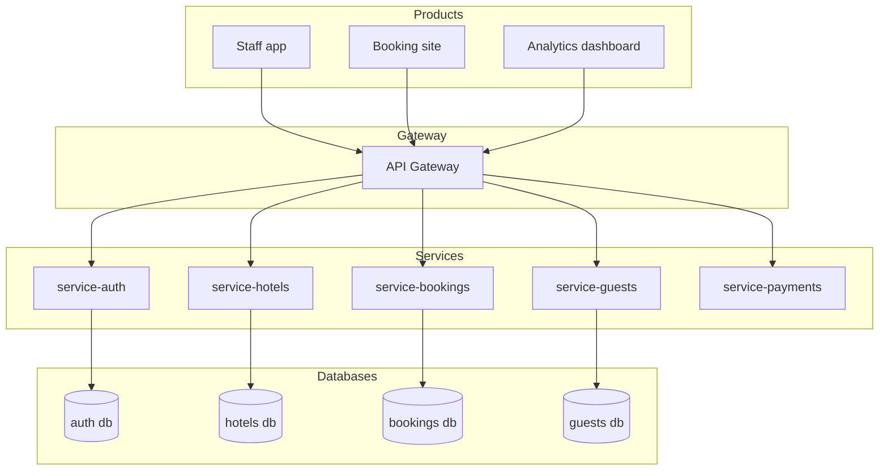
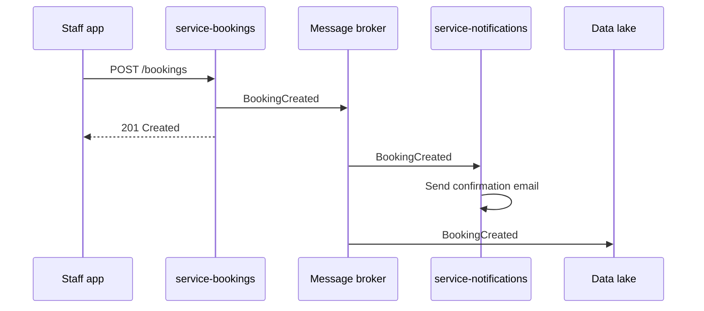
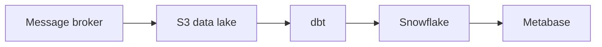

# System architecture

## Overview

## Services

| Service | Port | Responsibility |
|---|---|---|
| api-gateway | 3000 | Routing, auth middleware, rate limiting |
| service-auth | 3001 | Login, JWT, staff roles |
| service-hotels | 3002 | Hotels, rooms, availability |
| service-bookings | 3003 | Reservations, conflicts, status |
| service-guests | 3004 | Guest profiles, history |
| service-payments | 3005 | Payments, invoicing |

## Principles

- Each service owns its database. No shared database between services.
- Services communicate over HTTP/REST in phase 1.
- Authentication is handled at the gateway level, not per service.
- Each service is independently deployable.

## Phase 3 — Event-driven

## Key events

| Event | Producer | Consumers |
|---|---|---|
| BookingCreated | service-bookings | notifications, data lake |
| BookingCancelled | service-bookings | notifications, payments, data lake |
| PaymentConfirmed | service-payments | bookings, notifications, data lake |
| CheckInCompleted | service-bookings | housekeeping, data lake |
| CheckOutCompleted | service-bookings | payments, data lake |

## Phase 5 — Data pipeline

## Architecture decision records

| # | Decision | Status |
|---|---|---|
| ADR-001 | Microservices over monolith | accepted |
| ADR-002 | One database per service | accepted |
| ADR-003 | RabbitMQ in phase 3, Kafka in phase 5 | accepted |
| ADR-004 | Snowflake as data warehouse | accepted |
| ADR-005 | Markdown docs versioned in repo | accepted |
| ADR-006 | GitHub Actions for CI/CD | accepted |
