# Schémas

Référence visuelle de tous les flux et interactions du projet.
À consulter rapidement pendant le développement ou pour préparer des entretiens.

---

## 1. Hiérarchie du projet

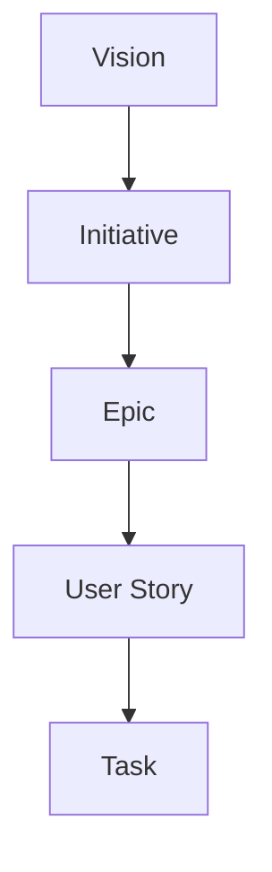

---

## 2. Trois produits, un seul système

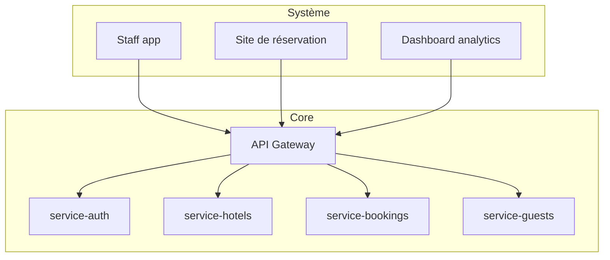

---

## 3. Équipe d'agents

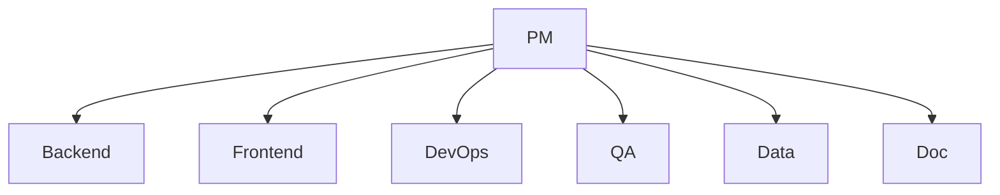

---

## 4. Pattern de configuration d'un agent

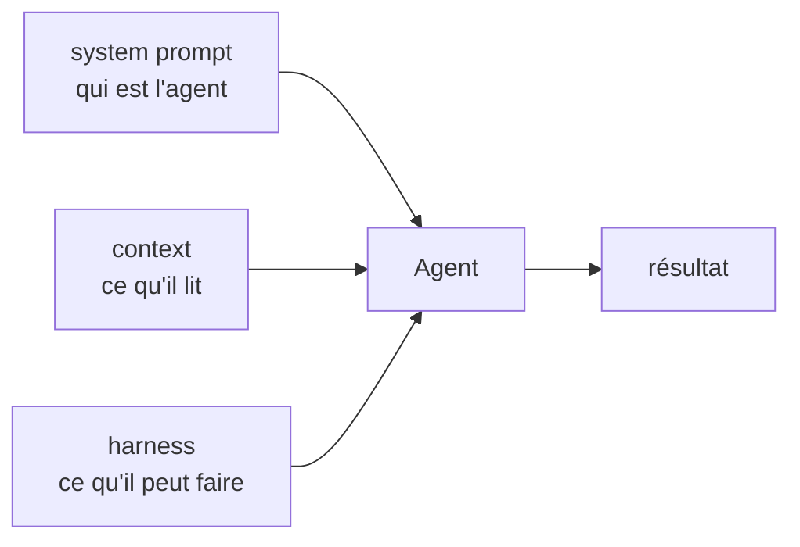

---

## 5. Pattern Route / Controller / Service

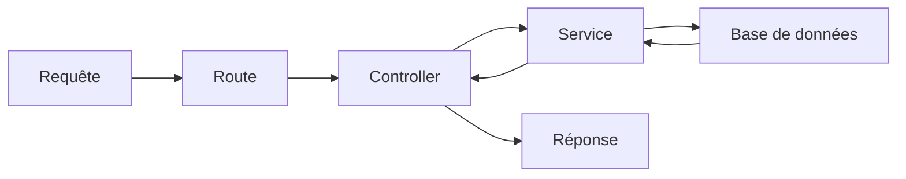

---

## 6. Flux d'authentification — JWT

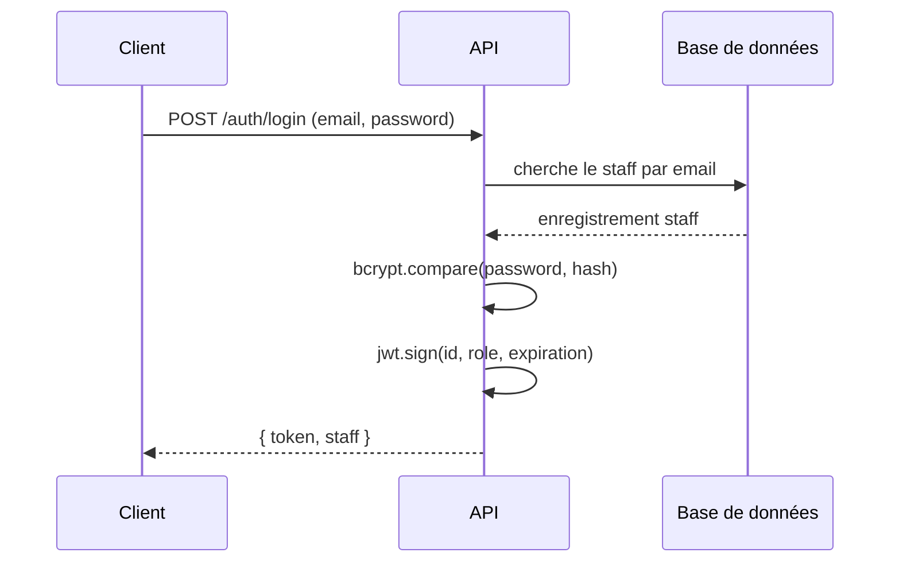

---

## 7. Flux d'une requête authentifiée

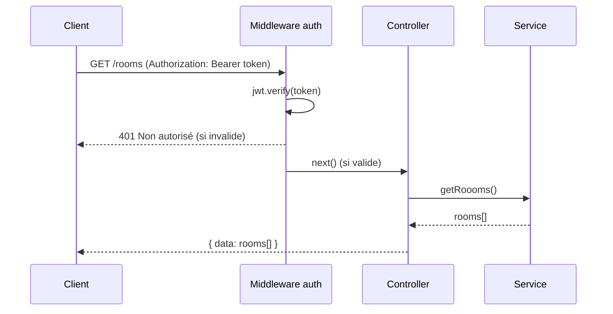

---

## 8. Docker Compose — setup local

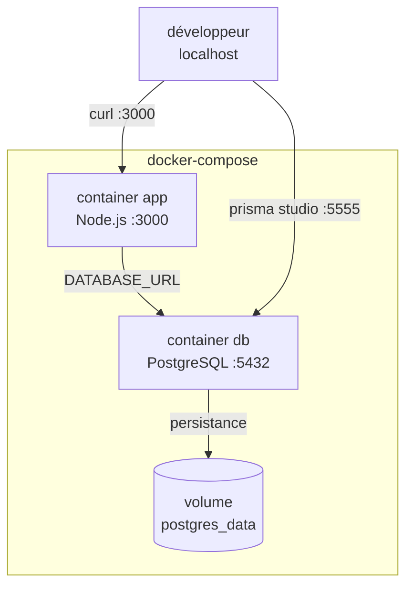

---

## 8b. Flux de migration Prisma

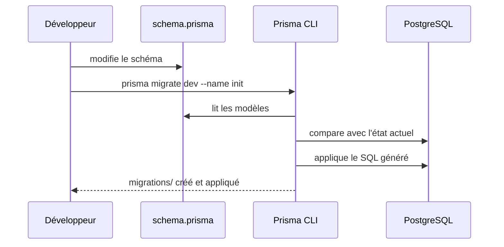

---

## 9. Pipeline CI/CD

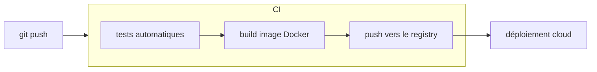

---

## 10. Flux event-driven — phase 3

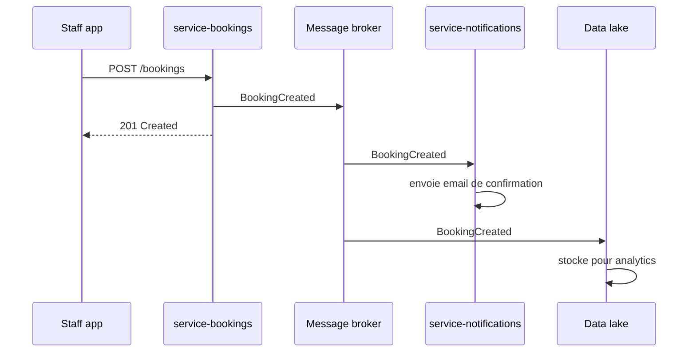

---

## 11. Pipeline data — phase 5

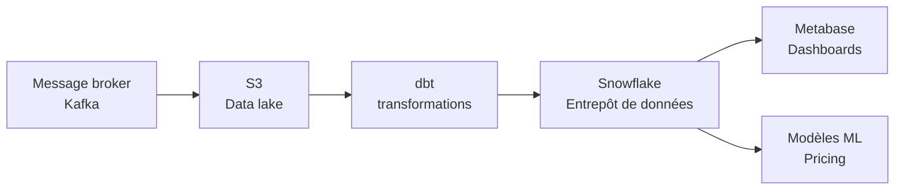