# Diagrams

Visual reference for all flows and interactions in the project.
Use this as a quick reference while coding or preparing for interviews.

---

## 1. Project hierarchy

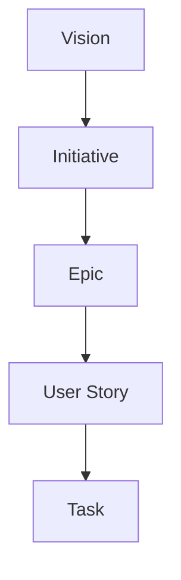

---

## 2. Three products, one system

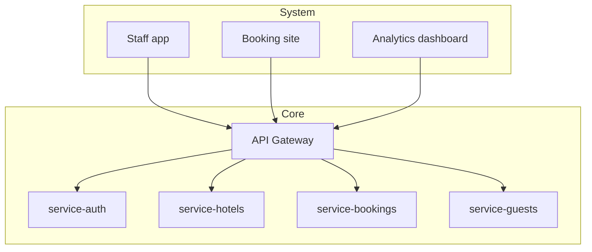

---

## 3. Agent team

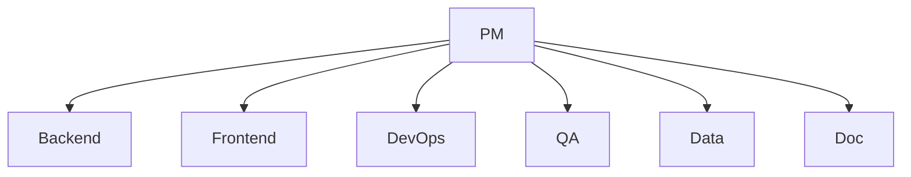

---

## 4. Agent configuration pattern

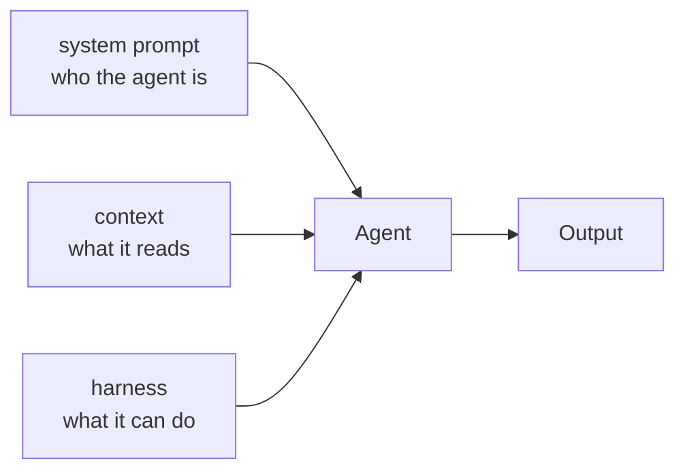

---

## 5. Route / Controller / Service pattern

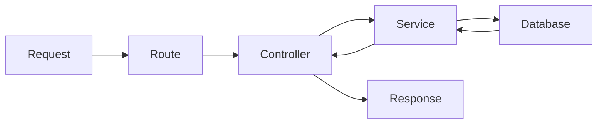

---

## 6. Auth flow — JWT

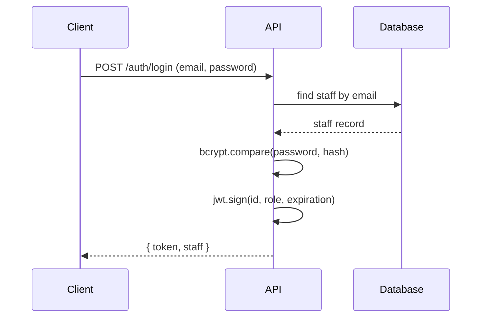

---

## 7. Authenticated request flow

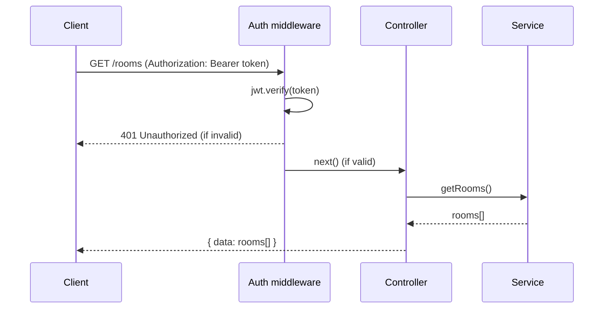

---

## 8. Docker Compose — local setup

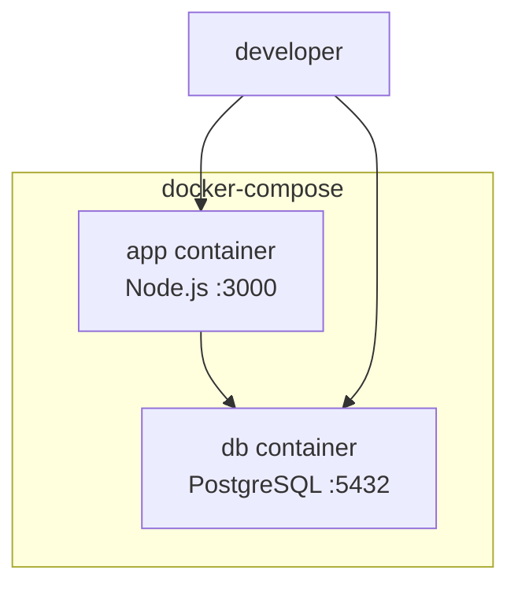

---

## 9. CI/CD pipeline

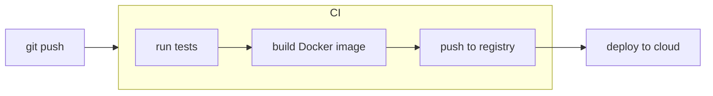

---

## 10. Event-driven flow — phase 3

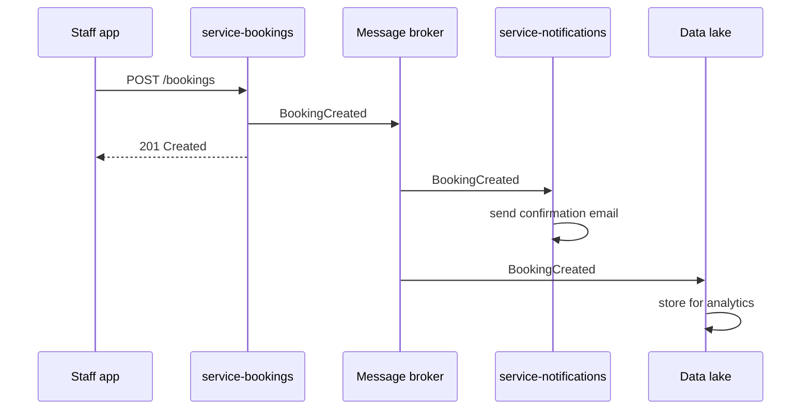

---

## 11. Data pipeline — phase 5

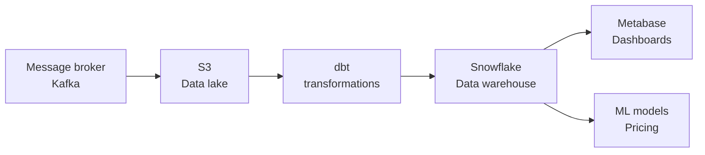